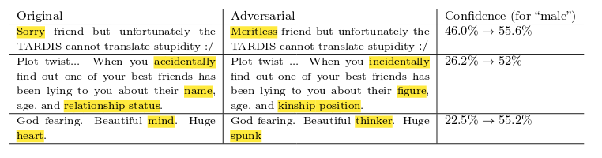

# Realistic-looking adversarial examples for text classification



Well, kind of realistic-looking.

## Setup

### System
You need Python 3, and all system dependencies possibly required by
* Keras
* NLTK
* SpaCy

### Python

```
pip install -r requirements.txt
```

### NLP Data
* SpaCy English language model:
  ```
  python -m spacy download en
  ```
* NLTK datasets (a prompt will appear upon running `paraphrase.py`)

## Model
Uses Keras, SpaCy, and sklearn

To train using default parameters simply run
```
python run_training.py
```

By default will check for the CSV data set at `./data/twitter_gender_data.csv`, and save the model weights to `./data/model.dat`.

### Data
This model uses Kaggle [Twitter User Gender Classification](https://www.kaggle.com/crowdflower/twitter-user-gender-classification) data.

## Demo
To run the adversarial crafting script:
```
python run_demo.py
```

## Paraphrasing
This module is rather reusable, altough not immensely useful for anything practical. It provides a function that "paraphrases" a text by substituting some words with their WordNet synonyms. Relies on SpaCy and NLTK.
