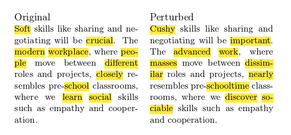

# Plausible looking adversarial examples for text classification

[](https://zenodo.org/badge/latestdoi/89886473)

This is a proof of concept aiming at producing "imperceptible" [adversarial examples](https://blog.openai.com/adversarial-example-research/) for text classifiers.

For instance, this are some adversarial examples produced by this code for a classifier of a tweet author's gender based on the tweet's text:


## Setup

### System
You need Python 3, and all system dependencies possibly required by
* Keras
* NLTK
* SpaCy

### Python

```
pip install -r requirements.txt
```

### NLP Data
* SpaCy English language model:
  ```
  python -m spacy download en
  ```
* NLTK datasets (a prompt will appear upon running `paraphrase.py`)

## Model
To train using default parameters simply run
```
python run_training.py
```
By default will check for the CSV data set at `./data/twitter_gender_data.csv`, and save the model weights to `./data/model.dat`.

Should attain about 66% accuracy on validation data set for gender recognition.

### Data
This model uses Kaggle [Twitter User Gender Classification](https://www.kaggle.com/crowdflower/twitter-user-gender-classification) data.

## Demo
To run the adversarial crafting script:
```
python run_demo.py
```
Success rate for crafting the adversarial example should be about 17%.
By default the script will write the crafted examples into `./data/adversarial_texts.csv`.

## Paraphrasing
This module is rather reusable, although not immensely useful for anything practical. It provides a function that "paraphrases" a text by replacing some words with their WordNet synonyms, sorting by GloVe similarity between the synonym and the original context window. Relies on SpaCy and NLTK.

Example of paraphrase:




## Citing notes

Please use [Zenodo link](https://zenodo.org/record/831638) to cite _textfool_. Not that this work is not published, and not peer-reviewed. _textfool_ has no relationship to _"Deep Text Classification Can be Fooled."_ by B. Liang, H. Li, M. Su, P. Bian, X. Li, and W. Shi.

